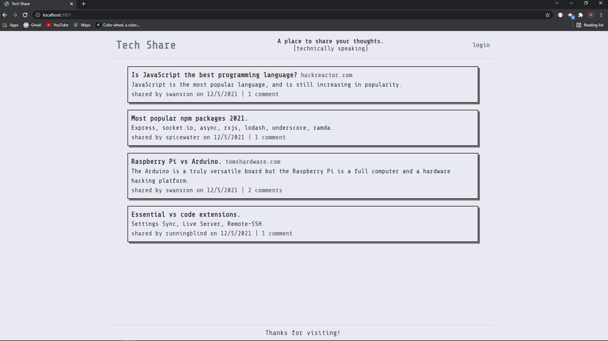

# Tech Share 
[Tech-Share](https://techshare-vs.herokuapp.com/)

## Application Description
A tech blog website that allows the user to create an account, sign in, and comment on existing posts. The user can sign in to create a post with the option to include a url to a relevant website or article. The user session is currently set to expire after five minutes.

## Table of Contents
* [Description](#application-description)
* [Installation](#installation)
* [Usage](#usage)
* [License](#license)
* [Contributions](#contributions)
* [Testing](#testing)
* [Questions](#questions)

## Installation
npm install

## Usage
Please use it.

## License
N/A

## Contributions
You can contribute by creating a new issue.

## Testing
N/A

## Questions
Please feel free to reach out with any questions or concerns. I can be reached at victorj500@gmail.com or on GitHub at github.com/vic-smith.

